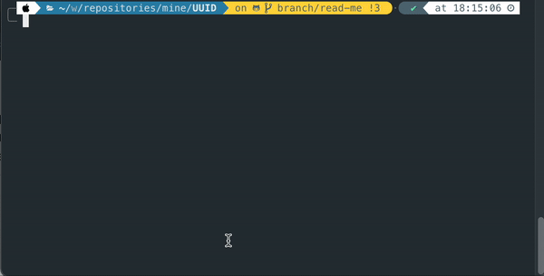
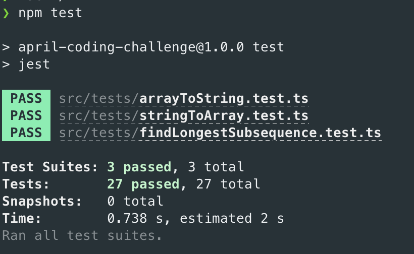

# UUID

This command line application takes one argument as string of numbers and outputs the longest sub sequence.

## Running the application locally
Step 1: Install dependencies
```
npm install
```
Step 2: Run with input
```
npm start <input string>
```
(See example below)
</hr>


## Running the tests
### locally
```
npm test
```
</hr>


### via docker-compose
If it's the first time running, run the below command to first build the image
```
docker-compose up --build
```
```
docker-compose run test
```

## Linting
### locally
```
npm run lint
```
or
```
npm run lint:fix
```

### via docker-compose
If it's the first time running, run the below command to first build the image
```
docker-compose up --build
```
```
docker-compose run lint
```

## CI pipeline (GitHub Actions)
Currently the GitHub Actions are triggered upon pull requests raised against the main branch and any push on the main branch.
You can view the status of the [GitHub Actions here](https://github.com/rozajay/UUID/actions). The actions are set to check that linting rules are conformed to and all existing tests passes accordingly. This is also checked against major node versions. 
